MediLink: Integrated Online Medicine Ordering and Inventory Management System                            

 # Overview

MediLink is a web-based platform designed to connect customers, pharmacies, and delivery personnel in a single system. The platform enables users to search for medicines, place orders, and track deliveries while allowing pharmacies to manage inventory and orders efficiently.

The goal of the system is to simplify medicine access and streamline pharmacy operations through a centralized digital platform.

# Tech Stack
Frontend: React.js  
Backend: Node.js, Express.js  
Database: MongoDB  

# Key Features
- Role-based access (Admin, Pharmacy Admin, Pharmcy Owner, Pharmacy Staff, Cashier, Customer, Delivery)
- Medicine search and nearby pharmacy discovery
- Inventory and stock management
- Order processing and tracking
- Payment verification system
- Delivery coordination

# Screenshots

## Landing Page
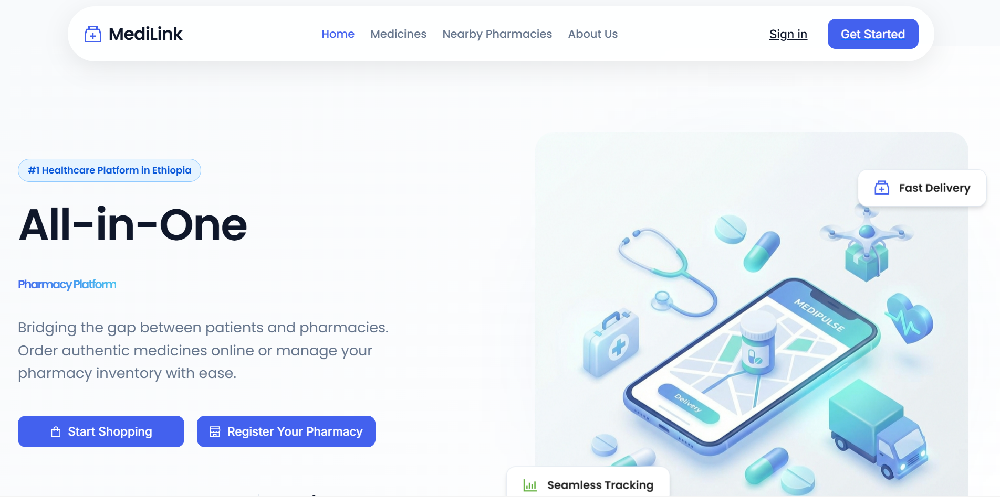
## Register Pages
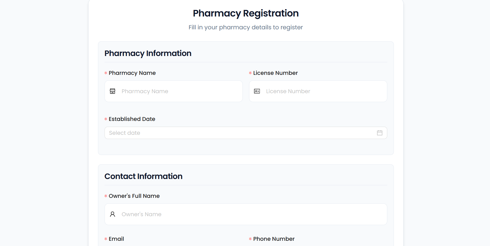
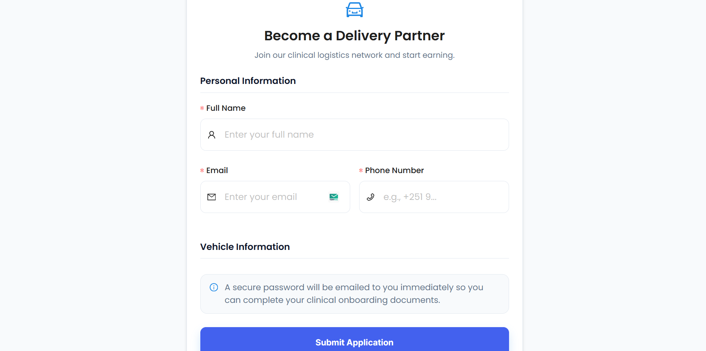
## Login Page
1.Users
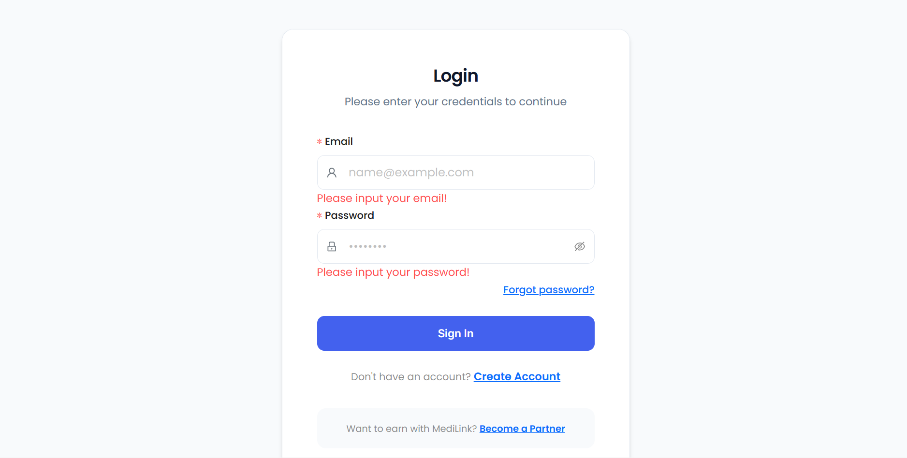
### Medicine Search
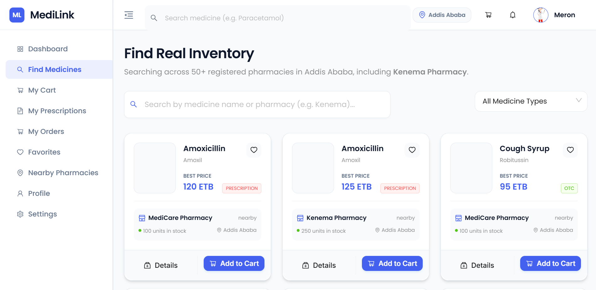

## System Admin Page
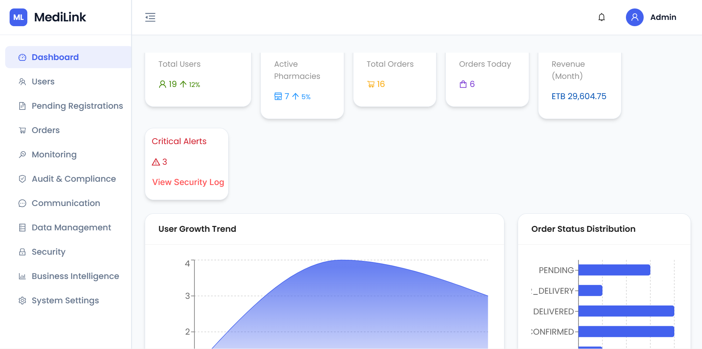
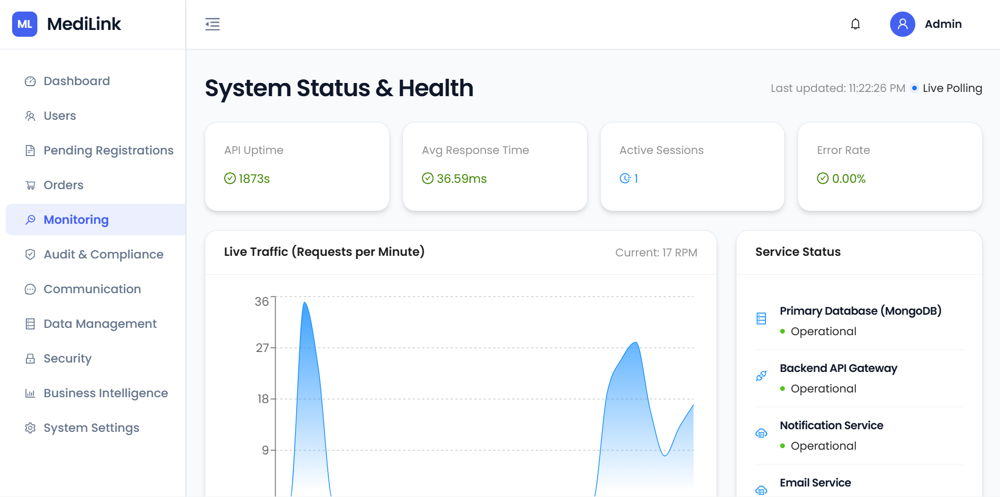
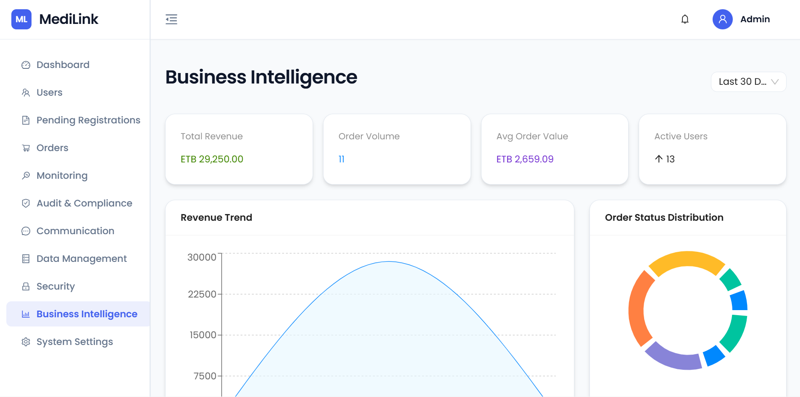
## Pharmacy Admin

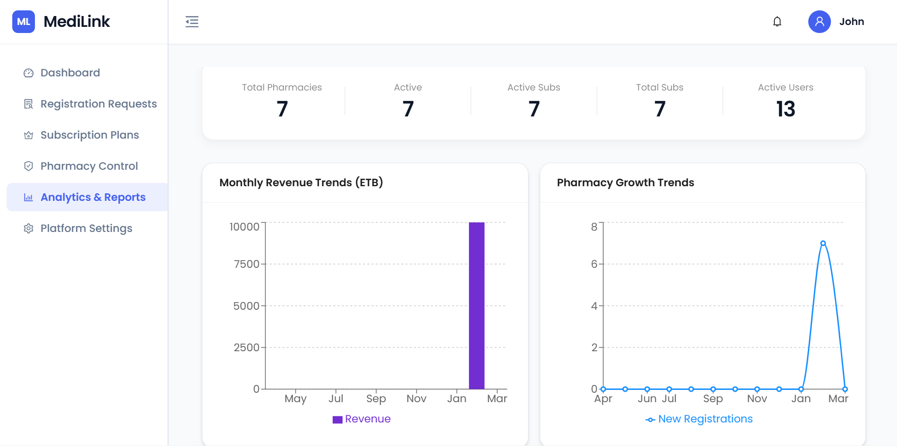
## Pharmacy Owner
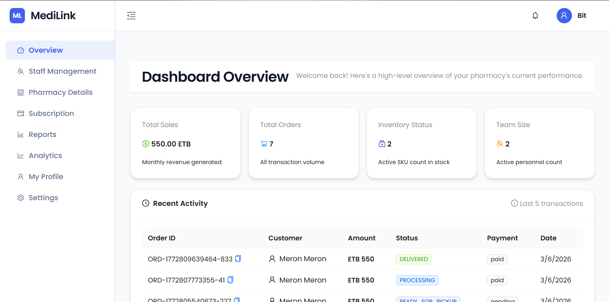
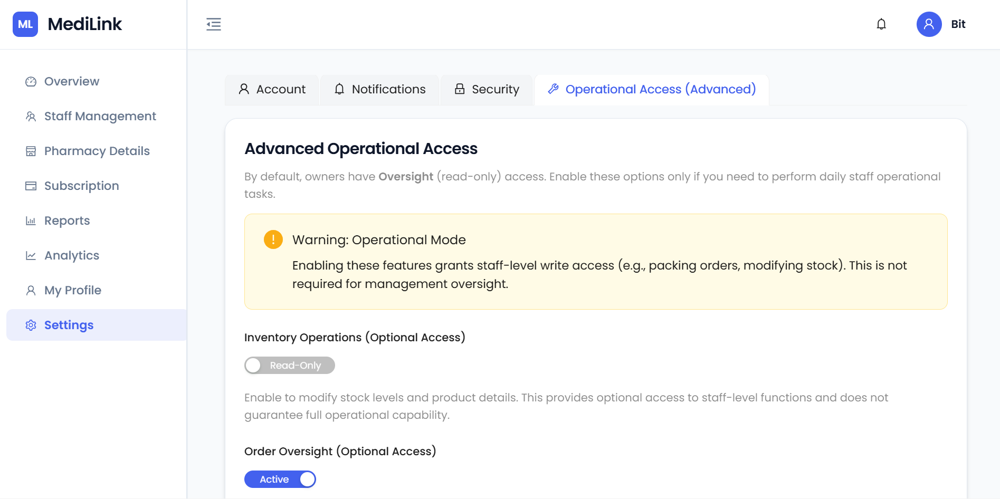
## Pharmacy Staff(Pharmacist)
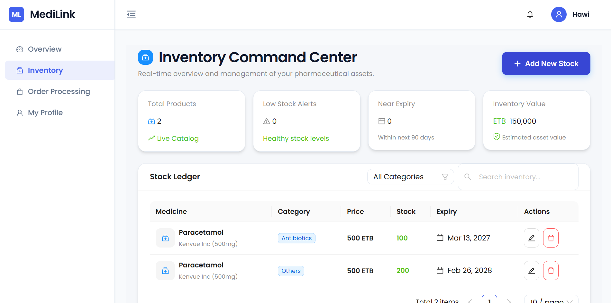

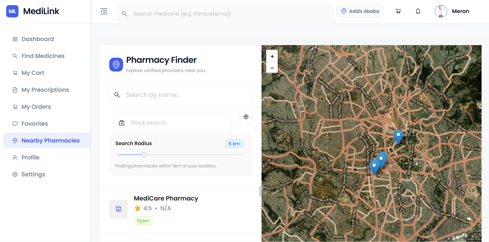
# Deliver Page
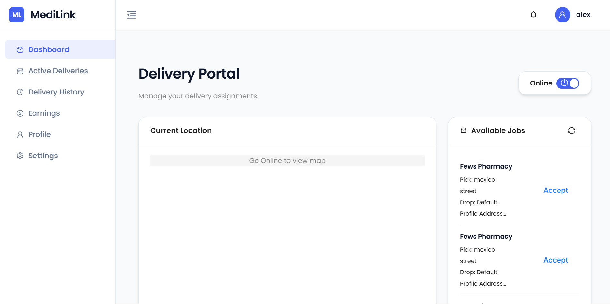

